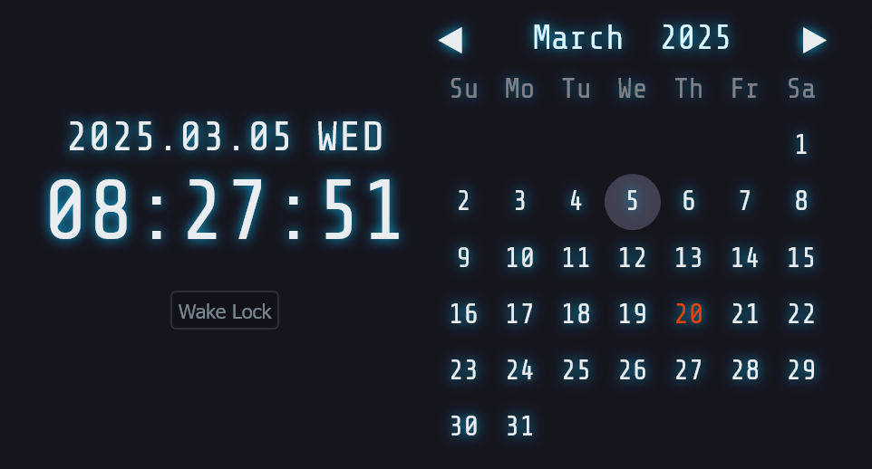
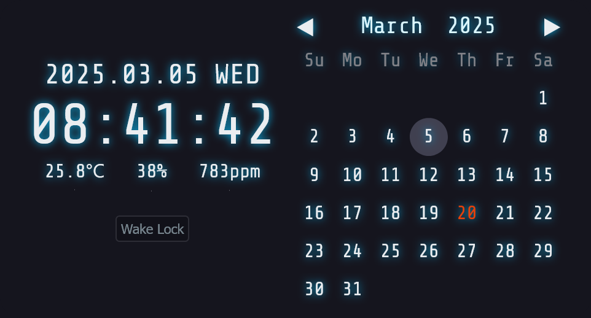
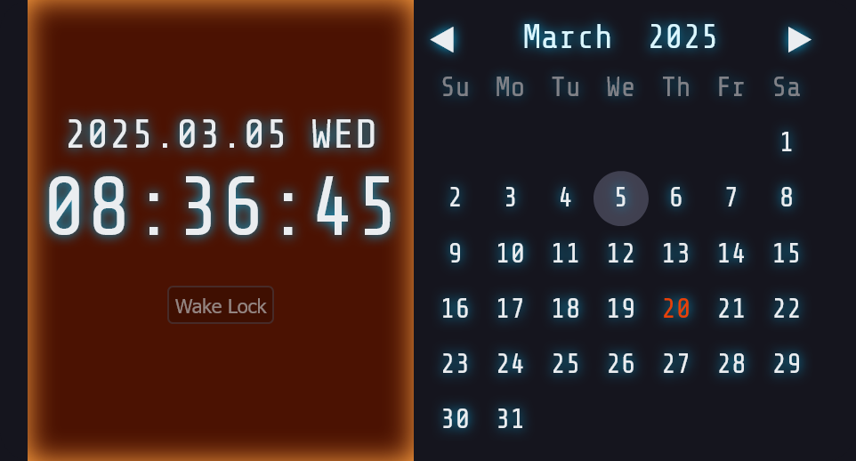

# ⏰️bclock



# Demo
https://kumanofoo.github.io/bclock/

## Installing bclock

'setup.sh' install bclock files to /opt/bclock directory.
```console
$ git clone https://github.com/kumanofoo/bclock.git
$ cd bclock
$ sudo bash setup.sh
```

## Installing nginx
```console
$ sudo apt install nginx
```

/etc/nginx/sites-available/default
```nginx
server {
    :
    :
  location /bclock/ {
    alias /opt/bclock/html/;
    index index.html;
  }
    :
    :
}
```


## Configuring bclock (Option)
By updating `air_quality.json`, Bclock can display air quality including room temperature, humidity, and CO2 concentration.


Additionally, by updating `peak.json`, Bclock can warn about pipe freezing and heatstroke.


The HTTP server for Bclock needs to support SSL to periodically retrieve `air_quality.json` and `peak.json`.

### Room Air Quarity


`air_quality.json`
```JSON
{
  "timestamp":1733300984,
  "tag":"living/SCD30",
  "temperature_deg_c": 25.8,
  "humidity_percent": 38.0,
  "co2_ppm": 783
}
```

### Peek of Temperature
If `highest` in `peak.json` is 30 or above and `lowest` is -4 or below, the clock background will change.



`peak.json`
```JSON
{
  "highest": 35.1,
  "lowest": 25.5
}
```

> [!NOTE]
> `tools/ompeak.sh` or `tools/jmapeak.sh` can be used to retrieve the temperature from [Open-meteo](https://open-meteo.com/) or [Japan Meteorological Agency](https://www.jma.go.jp/).

### Create Server Certificate
Create a key pair for the server and server certificate.
- server.domain.example.com.key
- server.domain.example.com.crt

Place these on /etc/ssl/localcert:
```console
sudo mkdir /etc/ssl/localcert
sudo mv server.domain.example.com.key server.domain.example.crt /etc/ssl/localcert
```

### Installing Server Certificate
/etc/nginx/sites-available/default
```nginx
server {
  listen 80;
  listen [::]:80;
   
  server_name server.domain.example.com;
  return 301 https://$host$request_uri;
}

server {
  listen 443 ssl default_server;
  listen [::]443 ssl default_server;
   
  ssl_certificate     "/etc/ssl/localcert/server.domain.example.com.crt";
  ssl_certificate_key "/etc/ssl/localcert/server.domain.example.com.key";
   
  root /var/www/html;
   
  server_name server.domain.example.com;

  location /bclock/ {
    alias /opt/bclock/html/;
    index index.html;
  }
}
```


# References
- [CSSとJavaScriptでおしゃれなデジタル時計を実装する方法](https://web-dev.tech/front-end/javascript/digital-clock/)
- [Learn How to Code a Simple JavaScript Calendar and Datepicker](https://webdesign.tutsplus.com/learn-how-to-code-a-simple-javascript-calendar-and-datepicker--cms-108322t)

